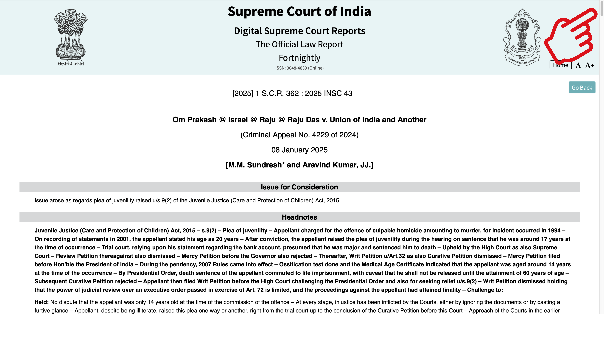
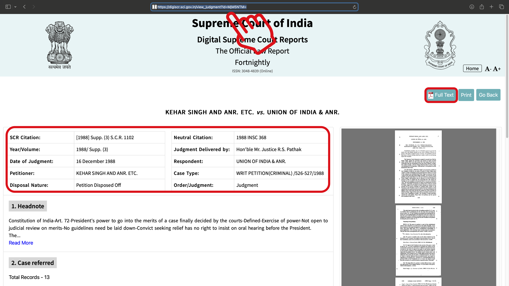

# 1 DATA COLLECTION WORK - SC PRECEDENTS

## 1.1 Objective

Research judgments or verdicts from the Supreme Court of India for legal precedents and collect the data into a spreadsheet. You will be given a specific year and a volume from this website: https://digiscr.sci.gov.in/. Please do not work on a different year or a different volume, as other researchers would be working on those and your work if duplicate is not useful.

## 1.2 Task

Browse through each judgment/order, and identify legal precedents. Remember, we are not looking for data regarding the judgment/order, but only for the precedents in references.

## 1.3 Deliverable

Look for the following data elements, for each precedent, and format it as the columns of a spreadsheet. Deliver the spreadsheet as an XLSX file or a CSV file.

## 1.4 Accuracy of Data

The data you collect must be ninety seven percent (97%) accurate. If you deliver data with 31 columns, only 2 columns can be inaccurate. More than this, your deliverable will be rejected (without payment). 

You must check the data manually. Please note that you can use AI tools to collect data, but most of them are notorious for delivering false data. So, be sure to double-check the data that AI tools give you. Using AI tools will CANNOT be an excuse for providing inaccurate data.

## 1.5 Completeness of Data

Your data must be at least 85% complete. If you deliver a row of 31 columns, you must have at least 26 correct values collected. If there are less than 26 values, your data will be rejected (without payment). 

Please download the [data sample](https://m.c) for examples of how to collect data. But please remember that the data sample has errors. That does not mean that your deliverable can have errors.

---

# 2 DATA FIELDS NEEDED - SC PRECEDENTS

## 2A (Column A) - DigiSC Page URL

**Definition:**  
The official Supreme Court judgment page. You can click on the HTML view of a page. 

Scroll down till you see **Case Law Cited.** 

Click on the precedent (one judgment will have multiple precedents, you need to collect data for each one by one). The data you need in the field is the URL on your browsers address bar. This field is mandatory and cannot be left empty. If you cannot locate this field, you must omit this row, as the data will not be accepted.

**Examples of Allowed Entries:**
- `https://digiscr.sci.gov.in/view_judgment?id=MzcyMw==`
- `https://digiscr.sci.gov.in/view_judgment?id=MTA0MDg=`

**Examples of Not Allowed Entries:**
- `"SC Judgment 2004 link"` (Missing URL)
- `"www.supremecourt.in/judgment"` (Incorrect format, must be from DigiSC)

## 2B (Column B) - DigiSC PDF Link

**Definition:**  
Direct link to download the judgment PDF from DigiSC. Must be a complete and accessible URL. This field is mandatory and cannot be left empty. If you cannot locate this field, you must omit this row, as the data will not be accepted.

**Examples of Allowed Entries:**
- `https://digiscr.sci.gov.in/admin/judgement_file/judgement_pdf/2004/volume%203/Part%20I/2004_3_56-67%20%20%20_1703307014.pdf`
- `https://digiscr.sci.gov.in/admin/judgement_file/judgement_pdf/2003/Supp.%20(4)/Part%20I/Ram%20Chandra%20Singh%20_%20Savitri%20Devi%20And%20Ors._1701324244.pdf`

**Examples of Not Allowed Entries:**
- `"Download PDF here"` (No direct URL)
- `"supremecourt.in/pdf"` (Incorrect domain, must be from DigiSC)

## 2C (Column C) - SCR Citation Number

**Definition:**  
The Supreme Court Reports (SCR) citation must follow one of these formats:
- `[YEAR] VOLUME_NUMBER S.C.R. PAGE_NUMBER (For standard citations)`
- `[YEAR] Supp. (VOLUME_NUMBER) S.C.R. PAGE_NUMBER (For supplements)`

This field is mandatory and cannot be left empty. If you cannot locate this field, you must omit this row, as the data will not be accepted.

**Examples of Allowed Entries:**
- `[2004] 3 S.C.R. 56`
- `[2003] Supp. (4) S.C.R. 543`

**Examples of Not Allowed Entries:**
- `"Supreme Court 2004 Ruling"` (Not in correct format)
- `"SCR Citation: Vol 3, 2004"` (Does not match required format)
- `(2003) Supp. 4 S.C.R. 543` (Brackers are used wrongly)

## 2D (Column D) - Neutral Citation Number

**Definition:**  
The neutral citation (INSC) must follow the format **[YEAR] INSC NUMBER**. This field is mandatory and cannot be left empty. If you cannot locate this field, you must omit this row, as the data will not be accepted.

**Examples of Allowed Entries:**
- `2004 INSC 181`
- `1993 INSC 344`

**Examples of Not Allowed Entries:**
- `"2004 SC Citation"` (Incorrect format)
- `"INSC Case 344 of 1993"` (Not in the correct format)

## 2E (Column E) - Date of Judgment

**Definition:**  
The date when the judgment was issued. It must be in **ISO 8601 format (YYYY-MM-DD)**, plus the letter T at the end. Do not miss this T as the excel will confuse the value.

**Examples of Allowed Entries:**
- `2004-03-17T`
- `1993-10-27T`

**Examples of Not Allowed Entries:**
- `"March 17, 2004"` (Incorrect format)
- `"17-03-2004"` (Not ISO format)
- `1993-10-27` (No T at the end)

## 2F (Column F) - Case Type

**Definition:**  
The category of the case. Use standard legal case types recognized in the Indian legal system. Please avoid abbreviations or shortening phrases.

**Examples of Allowed Entries:**
- `Civil Appeal`
- `Writ Petition`
- `Special Leave Petition`
- `Special Leave Petition (civil)`

**Examples of Not Allowed Entries:**
- `"Appeal"` (Too vague)
- `"Case Type: Civil"` (Incorrect format)

## 2G (Column G) - Case Number

**Definition:**  
The unique identifier for the case. Must follow the format **X/YYYY**. If there are more than one case numbers, seperate them with a semi-colon.

**Examples of Allowed Entries:**
- `1650/2004`
- `994/1972`

**Examples of Not Allowed Entries:**
- `"Case 1650 2004"` (Incorrect format)
- `"1650-2004"` (Wrong separator)

## 2H (Column H) - Disposal Nature

**Definition:**  
The final outcome of the case, indicating whether the appeal was allowed, dismissed, or otherwise disposed of.

**Examples of Allowed Entries:**
- `Appeals Allowed`
- `Appeals Dismissed`

**Examples of Not Allowed Entries:**
- `"Judgment Issued"` (Not specific enough)
- `"Case Completed"` (Not a legal term)

## 2I (Column I) - Order/Judgment

**Definition:**  
Specifies whether the document is an "Order" or a "Judgment."

**Examples of Allowed Entries:**
- `Judgment`
- `Order`

**Examples of Not Allowed Entries:**
- `"Verdict"` (Not a standard legal term)
- 

## 2J (Column J) - Laws Referenced

**Definition:**  
List all laws and legal sections referenced in the judgment. Use the format: **The Law Name, Year**. If multiple laws are cited, separate them with semicolons.

**Examples of Allowed Entries:**
- `The Code of Civil Procedure, 1908`
- `The Indian Trusts Act, 1882`
- `The Constitution of India; The Indian Evidence Act, 1872`

**Examples of Not Allowed Entries:**
- `"IPC Sec. 302"` (Abbreviation not allowed)
- `"Constitution of India"` (Missing article number)
- `"Various criminal laws applied"` (Too vague)

## 2K (Column K) - Petitioner Type

**Definition:**  
The role of the petitioner (first party) in the case. This could be **Appellant, Petitioner, Plaintiff**, or Other.

**Examples of Allowed Entries:**
- `Appellant`
- `Petitioner`
- `Plaintiff`
- `Respondent`

**Examples of Not Allowed Entries:**
- `"First Party"` (Not specific enough)
- `"Accused"` (Only applicable in criminal cases)

---

## 2L (Column L) - Petitioner Full Name

**Definition:**  
Full name of the petitioner (first party). If initials are present, remove periods (full stops) between letters, without abbreviations like "& Ors." Replace it with "and others."

**Examples of Allowed Entries:**
- `Ramesh Kumar Sharma`
- `T Rajagopal`
- `State of Maharashtra`
- `ABC Private Limited`

**Examples of Not Allowed Entries:**
- `"R.K. Sharma"` (Should not use initials with periods)
- `"Maharashtra & Ors."` (Use "and others" instead)
- `XYZ (P) Ltd.` (Abbreviation is not clear if P stands for Public or Private. Do not abbreviate)
- `State of UP` (UP should be expanded to Uttar Pradesh)

---

## 2M (Column M) - Responsdent Type

**Definition:**  
The role of the respondent (second party) in the case. This could be **Respondent, Defendant, Opponent**, or another litigant classification.

**Examples of Allowed Entries:**
- `Appellant`
- `Petitioner`
- `Plaintiff`
- `Respondent`
  
**Examples of Not Allowed Entries:**
- `"Second Party"` (Not specific enough)
- `"Opposing side"` (Not a legal classification)

## 2N (Column N) - Respondent Full Name

**Definition:**  
Full name of the respondent (second party). If only initials are present, remove periods (full stops) between letters, without abbreviations like "& Ors." Replace it with "and others."

**Examples of Allowed Entries:**
- `Union of India`
- `State of Tamil Nadu`
- `Manoj Kumar`

**Examples of Not Allowed Entries:**
- `"State of TN"` (Use full name)
- `"Company XYZ & Ors."` (Must replace "& Ors." with "and others")

---

## 2O (Column O) - Court Name

**Definition:**  
The name of the court where the judgment was delivered. Since this dataset only includes Supreme Court cases, always enter **"Supreme Court."**

**Examples of Allowed Entries:**
- `Supreme Court`

**Examples of Not Allowed Entries:**
- `"Delhi High Court"` (Wrong court)
- `"India SC"` (No abbreviation allowed)

## 2P (Column P) - Judges on Bench

**Definition:**  
List of judges involved in the case, separated by semicolons. If initials are present, remove periods (full stops) between letters.

**Examples of Allowed Entries:**
- `Ranjan Gogoi; Dipak Misra`
- `N.V. Ramana; U.U. Lalit`

**Examples of Not Allowed Entries:**
- `"Multiple judges"` (Must list names)
- `"Justice Dipak M."` (Should have full last name)

---

## 2Q (Column Q) Judgment Author

**Definition:**  
The name(s) of the judge(s) who wrote the judgment. Usually it is done by a single judge, but in case there are multiple names, separated by semicolons. If initials are present, remove periods (full stops) between letters

**Examples of Allowed Entries:**
- `Dipak Misra`
- `R.F. Nariman`

**Examples of Not Allowed Entries:**
- `"Supreme Court"` (Must specify the judge)
- `"Bench"` (Refers to multiple judges, not the author)

---

## 2R (Column S) - Year/Volume

**Definition:**  
The year and volume in the format: YYYY/ Volume X or YYYY/ Supp. (X).

**Examples of Allowed Entries:**
- `1958/ Volume 1` (A space is there between the slash (/) and the (V)olume)
- `2003/ Supp. (4)` (A space is there between the slash (/) and the (S)upp.)

**Examples of Not Allowed Entries:**
- `Year 2002, Volume 2"` (Not formatted correctly)
- `1993/Supp. 3"` (Incorrect spacing, and no brackets)

## 2S (Column S) - Indian Kanoon Link

**Definition:**  
The full URL link to the case judgment on Indian Kanoon.

**Examples of Allowed Entries:**
- `https://indiankanoon.org/doc/123456/`
- `https://indiankanoon.org/doc/abcdef/`

**Examples of Not Allowed Entries:**
- ~~Find it on Kanoon~~ (Must provide direct URL)
- ~~https://google.com~~ (Wrong website)

## 2T (Column T) - SCC Citation Number

**Definition:**  
The Supreme Court Case (SCC) citation must follow the format **(YEAR) VOLUME_NUMBER SCC PAGE_NUMBER**. Please note that this field may be impossible to find as SCC may not have published the specific case. This field is not compulsory as long as you have the SCR Citation and Neutral Citation numbers. If it is available, make sure to get it. If not, leave this cell blank.

**Examples of Allowed Entries:**
- `(2004) 3 SCC 56`
- `(1998) 5 SCC 1001`

**Examples of Not Allowed Entries:**
- ~~Supreme Court 2004 Ruling~~ (Not in correct format)
- ~~SCR Citation: Vol 3, 2004~~ (Does not match required format)
- ~~1998 3 SCC 199~~ (Brackets are not correctly used)

## 2U (Column U) - AIR Citation Number

**Definition:**  
The All India Reporter (AIR) citation must follow the format **AIR YEAR SC PAGE_NUMBER**. Please note that this field may be impossible to find as SCC may not have published the specific case. This field is not compulsory as long as you have the SCR Citation and Neutral Citation numbers. If it is available, make sure to get it. If not, leave this cell blank.

**Examples of Allowed Entries:**
- `AIR 1994 SC 853`
- `AIR 2010 SC (Supp)`

**Examples of Not Allowed Entries:**
- ~~Supreme Court 2004 Ruling~~ (Not in correct format)
- ~~SCR Citation: Vol 3, 2004~~ (Does not match required format)
- ~~1998 AIR 99~~ (Do not match required format)

## 2V (Column V) - JT Citation Number

**Definition:**  
The Judgment Today (JT) citation must follow the format **YEAR (VOLUME) JT PAGE_NUMBER**. Please note that this field may be impossible to find as SCC may not have published the specific case. This field is not compulsory as long as you have the SCR Citation and Neutral Citation numbers. If it is available, make sure to get it. If not, leave this cell blank.

**Examples of Allowed Entries:**
- `2005 (11) JT 439`
- `2004 (2) Suppl. JT 601`

**Examples of Not Allowed Entries:**
- ~~Judment Times 2004 Ruling~~ (Not in correct format)
- ~~JT 11 2005-439~~ (Does not match required format)
- ~~1998 JT 11-99~~ (Do not match required format)

## 2W (Column W) - SCALE Citation Number

**Definition:**  
The Supreme Court Alamanac (SCALE) citation must follow the format **YEAR (VOLUME) SCALE PAGE_NUMBER**. Please note that this field may be impossible to find as SCC may not have published the specific case. This field is not compulsory as long as you have the SCR Citation and Neutral Citation numbers. If it is available, make sure to get it. If not, leave this cell blank.

**Examples of Allowed Entries:**
- 2005 (11) SCALE 500
- 2004 (20) SCALE 1004

**Examples of Not Allowed Entries:**
- ~~SCALE 2004-11-555~~ (Does not match required format)
- ~~SC Alamanac 11 2005-439~~ (Does not match required format)
- ~~1998 SCA 11-99~~ (Does not match required format)

## 2X (Column X) Other Citation Numbers

**Definition:**  
Citations from **non-standard sources** (not SCC, SCR, INSC, AIR, JT, or SCALE). Use the exact format of the source.

**Examples of Allowed Entries:**
- `AIR 2004 Del 200`
- `MANU/SC/1234/2001`

**Examples of Not Allowed Entries:**
- ~~Other citations available~~ (Must list exact citation)
- ~~SC Citation~~ (Not specific)

## 2Y (Column Y) Legal Principle 1

**Definition:**  
The primary legal principle derived from the case. A legal principle is a short rule or idea that judges use to decide cases. It comes from past court decisions and helps everyone understand what is fair and unfair under the law. Think of it like a rule in a game—if one person breaks it, the referee (the judge) uses the rule to make a fair decision.

Creating this field might be challenging if you do not have a legal background. In that case, you can use an AI tool to help find the legal principles. However, this does not guarantee that the AI will give you the correct answers. By reading through, you must verify that the legal principle fits with existing precedents. Also, be aware that tools like OpenAI's ChatGPT, Google's Deep Mind, Meta's LLaMA, Amazon's Titan/Bedrock, and Microsoft's Copilot are known to provide inaccurate information. Relying only on the tool will ultimately lead to mistakes in your data. The best approach is to use the AI tool to gather data and manually check each field to see if the information is correct before including it in your final work.

**Examples of Allowed Entries:**
- `Fraudulent misrepresentation voids contracts`
- `A contract obtained through coercion is void`
- `Stealing is a crime, even if you return the item later`
- `A person is innocent until proven guilty`
- `Freedom of speech does not protect hate speech`
- `Mere recovery of a weapon does not prove guilt`
- `gift deed must be registered to be valid`
- `Divorce by mutual consent requires a cooling-off period`
- `Electronic evidence is admissible if forensic certified`
- `Pay must be equal for a man and woman doing the same job`
- `Silence is misrepresentation if there is a duty to disclose`

**Examples of Not Allowed Entries:**
- ~~The case was about fraud~~ (Too vague)
- ~~General legal discussion~~ (Not specific)
- ~~In cases where an individual has entered into a contractual agreement, whether written or verbal, and subsequently claims that they were under duress at the time of signing, the court must carefully examine all surrounding circumstances, including but not limited to the financial, emotional, and physical state of the individual~~ (Too long - can be shortened to "A contract signed under duress is void")

## 2Z (Column Z) Legal Principle 2

**Definition:**  
The secondary legal principle derived from the case. A legal principle is a short rule or idea that judges use to decide cases. It comes from past court decisions and helps everyone understand what is fair and unfair under the law. Think of it like a rule in a game—if one person breaks it, the referee (the judge) uses the rule to make a fair decision.

Creating this field might be challenging if you do not have a legal background. In that case, you can use an AI tool to help find the legal principles. However, this does not guarantee that the AI will give you the correct answers. By reading through, you must verify that the legal principle fits with existing precedents. Also, be aware that tools like OpenAI's ChatGPT, Google's Deep Mind, Meta's LLaMA, Amazon's Titan/Bedrock, and Microsoft's Copilot are known to provide inaccurate information. Relying only on the tool will ultimately lead to mistakes in your data. The best approach is to use the AI tool to gather data and manually check each field to see if the information is correct before including it in your final work.

**Examples of Allowed Entries:**
- `Fraudulent misrepresentation voids contracts`
- `A contract obtained through coercion is void`
- `Stealing is a crime, even if you return the item later`
- `A person is innocent until proven guilty`
- `Freedom of speech does not protect hate speech`
- `Mere recovery of a weapon does not prove guilt`
- `gift deed must be registered to be valid`
- `Divorce by mutual consent requires a cooling-off period`
- `Electronic evidence is admissible if forensic certified`
- `Pay must be equal for a man and woman doing the same job`
- `Silence is misrepresentation if there is a duty to disclose`

**Examples of Not Allowed Entries:**
- ~~The case was about fraud~~ (Too vague)
- ~~General legal discussion~~ (Not specific)
- ~~In cases where an individual has entered into a contractual agreement, whether written or verbal, and subsequently claims that they were under duress at the time of signing, the court must carefully examine all surrounding circumstances, including but not limited to the financial, emotional, and physical state of the individual~~ (Too long - can be shortened to "A contract signed under duress is void")

## 2AA (Column AA) Legal Principle 3

**Definition:**  
The third legal principle derived from the case. A legal principle is a short rule or idea that judges use to decide cases. It comes from past court decisions and helps everyone understand what is fair and unfair under the law. Think of it like a rule in a game—if one person breaks it, the referee (the judge) uses the rule to make a fair decision.

Creating this field might be challenging if you do not have a legal background. In that case, you can use an AI tool to help find the legal principles. However, this does not guarantee that the AI will give you the correct answers. By reading through, you must verify that the legal principle fits with existing precedents. Also, be aware that tools like OpenAI's ChatGPT, Google's Deep Mind, Meta's LLaMA, Amazon's Titan/Bedrock, and Microsoft's Copilot are known to provide inaccurate information. Relying only on the tool will ultimately lead to mistakes in your data. The best approach is to use the AI tool to gather data and manually check each field to see if the information is correct before including it in your final work.

**Examples of Allowed Entries:**
- `Fraudulent misrepresentation voids contracts`
- `A contract obtained through coercion is void`
- `Stealing is a crime, even if you return the item later`
- `A person is innocent until proven guilty`
- `Freedom of speech does not protect hate speech`
- `Mere recovery of a weapon does not prove guilt`
- `gift deed must be registered to be valid`
- `Divorce by mutual consent requires a cooling-off period`
- `Electronic evidence is admissible if forensic certified`
- `Pay must be equal for a man and woman doing the same job`
- `Silence is misrepresentation if there is a duty to disclose`

**Examples of Not Allowed Entries:**
- ~~The case was about fraud~~ (Too vague)
- ~~General legal discussion~~ (Not specific)
- ~~In cases where an individual has entered into a contractual agreement, whether written or verbal, and subsequently claims that they were under duress at the time of signing, the court must carefully examine all surrounding circumstances, including but not limited to the financial, emotional, and physical state of the individual~~ (Too long - can be shortened to "A contract signed under duress is void")
